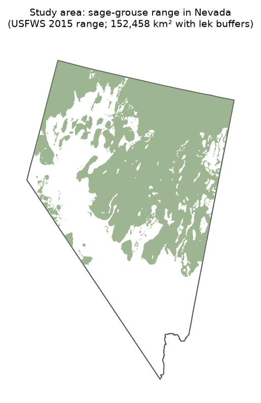
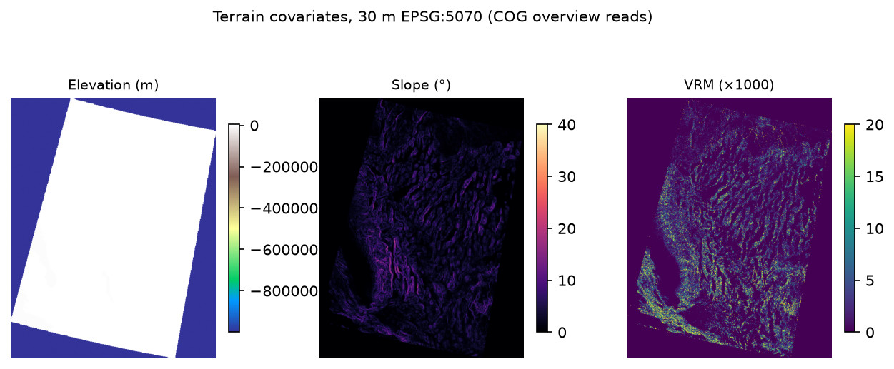
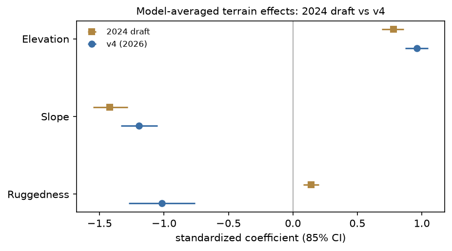
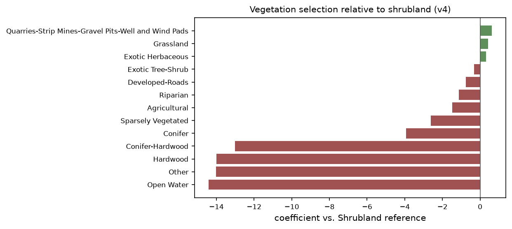

## What this is

A Resource Selection Function (RSF) analysis of Greater Sage-Grouse lek site
selection across Nevada, rebuilt as a fully replicable pipeline: every input
fetched by script from public sources (except sensitive lek locations, held
under NDOW agreement), every intermediate staged as GeoParquet or
Cloud-Optimized GeoTIFF, the model step in R matching the study's twelve
a priori GLMs, and every run reproducible byte-for-byte from a cold shell.

**No lek locations appear in this document or any public artifact.**

## The pipeline, in run order

| Step | What it does |
|---|---|
| `fetch_tnm.py` | 3DEP 1-arc-second DEM tiles, vintage-deduplicated, manifested |
| `build_dem.sh` | 30 m EPSG:5070 COG mosaic + slope, aspect, TRI |
| `build_vrm.py` | Vector Ruggedness Measure (Sappington et al. 2007), 3×3 |
| `fetch_landfire.py` | LANDFIRE LF2025 EVT clip via the LFPS v2 API |
| `fetch_vectors.py` | Range, boundary, roads → EPSG:5070 GeoParquet |
| `prepare_design.py` | Study area + seeded used/available design |
| `extract_covariates.py` | Covariates sampled at design points |
| `fit_models.R` | 12 GLMs → AICc → top-3 model average → reports |

## Study area

{width=55%}

USFWS 2015 sage-grouse range clipped to Nevada plus 5-km buffers around
active leks outside it: **152,458 km²**. Design: **718 used leks**
(NDOW, active status) and **7,180 seeded random available points**
(10 per used lek).

## Terrain covariates



Elevation from current 3DEP; slope and aspect via GDAL; ruggedness is the
**Vector Ruggedness Measure** — surface-normal dispersion, a geometric
property of terrain. We evaluated range-position focal indices and found
them dominated by DEM-vintage-specific texture (63% cell agreement across
DEM generations, where chance is 50%) and nearly uncorrelated with terrain
geometry; VRM measures the real thing and is the standard in the wildlife
habitat literature.

## Model results



| Term | 2024 draft | v4 (2026) |
|---|---|---|
| Slope | −1.42 (−1.55, −1.28) | **−1.19 (−1.34, −1.05)** |
| Elevation | +0.78 (0.69, 0.86) | **+0.96 (0.87, 1.05)** |
| Ruggedness | +0.14 (0.08, 0.20)¹ | **−1.02 (−1.27, −0.76)** |

¹ Different instrument: the draft used a range-position focal index
(subsequently found unstable across DEM vintages); v4 uses VRM.

The slope and elevation effects replicate the 2024 draft almost exactly on
entirely new data. Measured with VRM, ruggedness shows **strong avoidance**:
used lek sites average VRM 0.00046 versus 0.00197 across availability —
display grounds sit on terrain roughly four times smoother than what the
landscape offers. Same top-3 model set (m1, m7, m2); VIF 1.0–1.5 throughout.

## Vegetation



Relative to shrubland: grassland and exotic herbaceous cover sit above the
reference (open herbaceous sites are favored for display), while conifer,
sparsely vegetated, and riparian classes fall well below — conifer most
strongly avoided, consistent with the encroachment literature.

## The picture

Leks sit on **gentle, smooth, high, open ground** — low slope, low
surface ruggedness, higher elevation, herbaceous-over-conifer cover. Every
piece of that sentence is now supported by a coefficient with a clean CI,
estimated from current public terrain and vegetation data against NDOW's
lek register.

## Reproducing this

```bash
uv run pipeline/fetch_vectors.py
python3 pipeline/fetch_tnm.py --dataset "National Elevation Dataset (NED) 1 arc-second" \
  --bbox="-120.01,35.0,-114.03,42.01" --manifest data/manifest-3dep-v4.json
bash pipeline/build_dem.sh
uv run pipeline/build_vrm.py
python3 pipeline/fetch_landfire.py --layer LF2025_EVT --bbox "-120.01 35.0 -114.03 42.01" \
  --email you@example.com --out data-local/landfire/evt.zip
uv run pipeline/prepare_design.py
uv run pipeline/extract_covariates.py
Rscript pipeline/fit_models.R
```

Lek data must be requested from the Nevada Department of Wildlife.
A Dockerfile and CI smoke test are planned so the whole chain runs with
one command on any machine.
