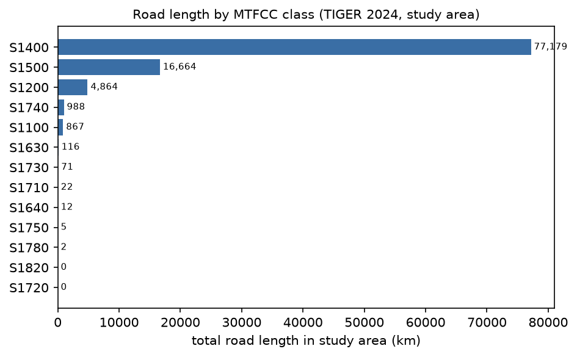
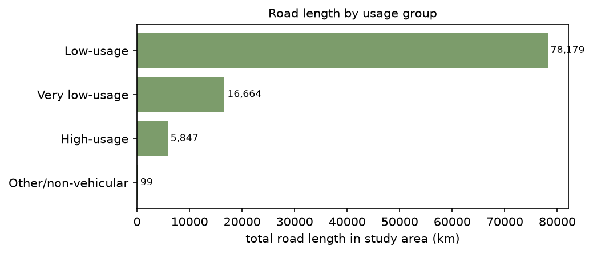
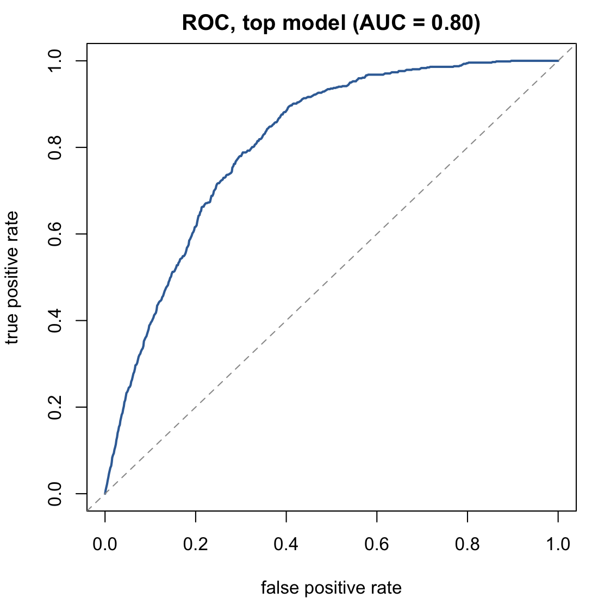

¹ Department of Plant and Wildlife Sciences, Brigham Young University, Provo, Utah 84602.
² Department of Applied Ecology, North Carolina State University, Raleigh, North Carolina 27695.

## Abstract

Following a significant population reduction and the degradation of sagebrush
habitats throughout the Great Basin, greater sage-grouse (*Centrocercus
urophasianus*) has become a species of conservation concern. Rangeland
managers continue to seek ways to improve management strategies by accurately
locating and characterizing habitat for sage-grouse, including lek site
locations. Lek counts have proven useful for long-term population monitoring;
understanding the selection of lek sites by sage-grouse remains a priority
for conservation efforts. The purpose of this study is to locate areas with
the highest potential of lek presence and identify environmental attributes
characteristic of lek sites using a resource selection function (RSF). We
incorporated 30-m resolution spatial data with the coordinate locations of
currently active lek sites to model site selection across the species'
152,458-km² distribution in Nevada, USA. We fit fifteen candidate models
to predict lek occurrence: twelve a priori covariate combinations and a
planned second-stage decomposition distinguishing paved from unpaved road
classes. Leks were more likely
to occur at higher elevations (model-averaged β = 0.94, 85% CI 0.85 – 1.03)
and less likely to occur on steeper slopes (β = −1.31, 85% CI −1.47 – −1.16),
on rugged terrain measured by the Vector Ruggedness Measure (β = −1.02, 85%
CI −1.27 – −0.76), and on level ground lacking measurable slope (β = −1.20).
Grassland cover was favored over the shrubland reference (β = 0.44, 85% CI
0.15 – 0.72), while conifer cover held fewer than five of 718 lek sites and,
pooled with other rarely used classes, was strongly avoided. Distinguishing
road classes revealed opposing associations: leks sat farther from paved
roads (β = 0.10, 85% CI 0.03 – 0.16) and, more weakly, closer to unpaved
roads and vehicular trails (β = −0.09, 85% CI −0.19 – 0.01). The averaged
model discriminated well (AUC = 0.81; spatially blocked cross-validation
0.80 ± 0.04) and, excepting an attenuated grassland effect, its
predictions were robust to post-2018 vegetation change at lek sites. The analysis is implemented as a fully scripted, openly
licensed pipeline in which every environmental input is fetched from its
authoritative public source and every run is exactly reproducible. Our results are useful for rangeland managers and researchers
in Nevada seeking to understand and improve greater sage-grouse population
estimates using lek locations and counts.

**Keywords:** habitat selection, modeling, Nevada, resource selection function

## Introduction

Greater sage-grouse (*Centrocercus urophasianus*; hereafter sage-grouse) is
a sagebrush obligate bird species that relies on intact sagebrush ecosystems
for reproduction and survival [1]. Sage-grouse populations have generally
been in decline since the 1960s in response to the loss, fragmentation, and
degradation of sagebrush habitat (WAFWA, 2015). Connelly and Braun (1997)
[2] estimated that, by 1997, sage-grouse breeding populations had declined
by 17–47% (range-wide average of 33%). Urban expansion, resource extraction,
invasion of non-native exotic grasses, invasion of pinyon-juniper woodland,
wildfire and novel disturbance regimes, and over-utilization of rangelands
through excessive grazing have all contributed to the decline of sage-grouse
[2, 5]. The potential consequence of these impacts is increased
fragmentation and isolation of sage-grouse populations [6], and range-wide
monitoring continues to document population concern, including in the
Bi-State region of Nevada and California [36].

Sage-grouse are a lekking bird species that utilize open areas to display
and breed [1, 7]. Because sage-grouse congregate at lek sites during the
breeding season, these areas are often used as a focal point for monitoring
bird populations and establishing management priorities and conservation
objectives [3, 8]. Lek count data can help determine the presence and/or
abundance of nesting habitat across the surrounding landscape [6]. Active
leks and peak counts of male sage-grouse have been linked to source habitats
[9], suggesting that the density of sage-grouse at lekking areas is a
reliable indicator of habitat quality [10]. Monitoring lek sites throughout
the species range can help managers and researchers better understand and
protect sage-grouse populations. Though some variation in methodology and
sampling biases exists, lek monitoring is still useful for informing
sage-grouse-related conservation decisions [11, 12], and lek-count time
series now anchor range-wide early-warning systems for population declines
[37]. A comprehensive
knowledge of existing lek locations and site selection is critical for
informed conservation and management decisions related to sage-grouse.

Our objectives were to 1) predict lek locations throughout the greater
sage-grouse range in Nevada using landscape data from currently active lek
sites and 2) describe the characteristics of active lek sites throughout
their range in Nevada using a resource selection function. Active leks can
be used to understand characteristics of potentially unknown active lek
sites and provide a basis for new areas to survey for lek counts. Many
studies have incorporated leks in their analyses and predictions of
sage-grouse habitat use and quality in Nevada [8, 13, 14, 15, 16, 17, 18,
19], and recent range-wide products integrate space use, habitat selection,
and survival at broad spatial scales to guide land-use planning [31].
However, these studies either delineated most or all landscape variables at
relatively coarse resolutions (1-km²), incorporated lek location data from
shorter time frames (5–6 years), did not predict new lek locations, or
utilized location data other than lek sites (i.e., telemetry data). Our
study improves upon past research as it incorporates fine-scale landscape
variables (30-m resolution), builds upon a rich statewide dataset, and
provides land managers with specific areas to target future lek surveys and
conservation planning.

## Methods

### Study Area

We determined the extent of the study — **152,458 km²** — using the
sage-grouse species distribution range for the state of Nevada, USA [32],
combined with a 5-km buffer around active leks that fell outside the
traditional range (Fig. 1). The range polygon is the current-range layer
compiled for the U.S. Fish and Wildlife Service's 2015 status review, which
integrated the Schroeder et al. (2004) range delineation with the Priority
Areas for Conservation identified in the 2013 Conservation Objectives Team
report; it is distributed through USGS ScienceBase and was clipped to the
Nevada state boundary for this analysis. Sage-grouse inhabit rangelands throughout the
state generally characterized as high elevation, cool desert ecosystems with
hot, dry summers and cold winters. Wyoming big sagebrush (*Artemisia
tridentata wyomingensis*), low sagebrush (*Artemisia arbuscula*), and black
sagebrush (*Artemisia nova*) shrub species largely dominate the areas that
fall below 2,100-m in elevation. At higher elevations, mountain big
sagebrush (*Artemisia tridentata vaseyana*) is the dominant vegetation. The
dominant conifers in this range include Utah juniper (*Juniperus
osteosperma*) and single-leaf pinyon pine (*Pinus monophylla*) that tend to
colonize mid- to high-elevation and mesic sagebrush habitats (Coates et al.,
2020). Dominant grasses include cheatgrass (*Bromus tectorum*), bottlebrush
squirreltail (*Elymus elymoides*), crested wheatgrass (*Agropyron
cristatum*), Sandberg bluegrass (*Poa secunda*), and many other annual and
perennial species.

{width=55%}

### Data Acquisition

To determine lek locations, we acquired the state of Nevada's historical
lek count dataset from the Nevada Department of Wildlife (NDOW) in 2020.
The dataset included lek center GPS locations and annual male counts for
all known leks throughout the state of Nevada from 1947–2018. Lek sites
were characterized as active, inactive, historic, no activity, or unknown.
This study analyzed leks that were categorized as "active" as of 2018 and
located within Nevada (n = 718, from 2,253 records statewide), omitting all
others. (An earlier draft reported n = 716; the register contains 718
in-state active records, and the full pipeline reconciles the count
programmatically.)

Environmental and anthropogenic data were acquired programmatically from
their authoritative public sources, and every acquisition writes a
provenance manifest (source URL, publication date, size) alongside the
data.

**Elevation** comes from the USGS 3D Elevation Program (3DEP), the national
program that is systematically replacing legacy National Elevation Dataset
sources with lidar-derived elevation. We used the seamless 1 arc-second
(~30-m) product, distributed as one-degree cloud-optimized GeoTIFF tiles
through The National Map API. Because the API returns multiple product
vintages for the same tile footprint, the fetch step deduplicates to the
most recent publication per cell; the 72 tiles used here carry publication
vintages spanning 2013–2026, reflecting the progress of lidar acquisition
across Nevada.

**Vegetation** comes from LANDFIRE, the interagency (U.S. Department of the
Interior and USDA Forest Service) landscape-scale mapping program. We used
the Existing Vegetation Type (EVT) layer from the LF2025 release at its
native 30-m resolution, requested as a statewide clip through the LANDFIRE
Product Service API, and classified sites by the layer's physiognomy
attribute (EVT_PHYS).

**Roads** come from the U.S. Census Bureau's TIGER/Line extracts (2024
vintage) of the MAF/TIGER database — the successor to the Feature Class
Code (FCC) roads data used in earlier analyses of this system, now
classified under the MTFCC schema. County-level road files include every
class from primary highways (S1100) through local roads (S1400) and
unimproved vehicular trails (S1500); all 17 Nevada county files were merged
(202,967 segments).

**External validation** uses the USGS data release accompanying Open-File
Report 2024-1018 [31]: telemetry-based habitat-selection and survival
rasters for greater sage-grouse in Nevada and northeastern California
(ver. 3.0, September 2025) [40], from which we used the spring (breeding
season) habitat-selection categories.

| Input | Service | Product | Volume |
|---|---|---|---|
| Elevation | USGS The National Map API (`tnmaccess.nationalmap.gov`) | 3DEP 1 arc-second, cloud-optimized GeoTIFF tiles | 72 one-degree tiles, 3.6 GB, tile vintages 2013–2026, deduplicated to the most recent publication per cell |
| Vegetation | LANDFIRE Product Service API (`lfps.usgs.gov`) | LF2025 Existing Vegetation Type, EVT_PHYS attribute | statewide clip, 30 m |
| Roads | U.S. Census TIGER/Line (2024) | all-classes county road files (MTFCC schema) | 17 counties, 202,967 road segments |
| Range | USGS ScienceBase item API | USFWS 2015 Status Review current range [32] | 556 polygons, clipped to Nevada |

The DEM tiles were mosaicked and warped to a common 30-m analysis grid
(EPSG:5070, Albers equal-area), from which all terrain derivatives were
computed; the vegetation and distance-to-road surfaces were aligned to the
same grid. Intermediate layers are staged as cloud-optimized GeoTIFF and
GeoParquet.

### Statistical Analysis

We conducted a resource selection function (RSF) based on 718 known lek
locations throughout the state of Nevada to 1) predict areas with potential
lekking activity and 2) quantify active lek site characteristics. We used a
use-availability study design where each lek site was considered a sampling
unit [20]. The leks were considered the "used" points in the analysis and
were compared to randomly generated "available" points. We generated ten
available points per used lek (n = 7,180) as a seeded uniform random sample
within the study area, making the availability draw exactly reproducible.

### Predictor Variables

Generating RSF predictions requires measurements of multiple predictor
variables at each "used" and "available" site. Environmental data included
LANDFIRE vegetation cover types (Existing Vegetation Type physiognomy) [28]
and elevation from a 30-meter digital elevation model (DEM). The vegetation
cover layer's physiognomy classes include conifer, conifer-hardwood, exotic
herbaceous, exotic tree-shrub, grassland, quarries–strip mines–gravel
pits–well/wind pads, riparian, shrubland, sparsely vegetated, developed,
agricultural, and open water. Classes with fewer than 10 sites overall, or
fewer than 5 used leks, were pooled into a single "other" category: a class
containing almost no used points cannot support a stable coefficient, and
retaining such classes produced quasi-complete separation (inflated
coefficients with standard errors in the hundreds) in earlier fits of this
dataset. DEM derivatives
included aspect, slope, curvature, and ruggedness. We elected to use a 30-m
DEM to examine patterns at a fine scale across the region. We accounted for
anthropogenic activity by calculating the Euclidean distance from each site
to the nearest road. All data processing is automated and documented in an
openly licensed pipeline built on GDAL, Python, and R; intermediate layers
are staged as cloud-optimized GeoTIFF and GeoParquet.

We categorized aspect into eight cardinal directions — north (N), east (E),
south (S), west (W), northeast (NE), northwest (NW), southeast (SE), and
southwest (SW) — plus a ninth category, Flat, for cells with slope below
0.5°, where aspect is undefined; conflating such cells with north-facing
terrain (the default behavior of common aspect tools) would contaminate the
aspect effects, because leks preferentially occupy gentle ground. Ruggedness was quantified with the Vector Ruggedness Measure
(VRM) [33], computed over a 3×3 (90-m × 90-m) window from the slope and
aspect surfaces. VRM measures the dispersion of surface-normal vectors — a
geometric property of terrain — and is decorrelated from slope by
construction (r = 0.40 in our design), making it well suited to models that
include both terms; it is the standard ruggedness metric in wildlife
habitat analysis [33]. (Earlier analyses of this dataset used a
range-position focal index whose values proved unstable across DEM
generations and which entered those models as an effectively binary
covariate; ruggedness results are therefore not directly comparable across
versions of this analysis.)

The roads dataset comprised all Census TIGER/Line road classes (MTFCC
schema) — 100,790 km of road within the study area — dominated by local
roads and unimproved vehicular trails (Table 1, Table 2; Figs. 2a–2b in
supporting charts below).

{width=70%}

{width=65%}

**Table 1.** MTFCC classes present in the study area.



**Table 2.** MTFCC classes aggregated to usage groups.


 From the merged network we computed three Euclidean-distance surfaces on
the DEM grid, ensuring cell-location continuity with the elevation-derived
rasters: distance to any road, distance to paved roads (MTFCC S1100, S1200,
S1630), and distance to unpaved roads and vehicular trails (S1400, S1500).
The class-specific surfaces allow the models to separate a disturbance
signal (proximity to high-use roads) from an association with the
unimproved routes that thread open terrain. Finally, elevation, aspect,
slope, curvature, ruggedness, the three road-distance measures, and
vegetation cover types were sampled at each used and available location. To validate that we had enough
random points to assess available habitat, we compared the mean of the
study area's pixels for each continuous variable (estimated with a dense
100,000-point Monte Carlo sample at full raster resolution) against the
available-sample mean and its 85% confidence interval (S1 Table).

### Resource Selection Function

We calculated the prediction values for the RSF using logistic regression
with used (n = 718) and available (n = 7,180) points. Prior to running the
models, we checked for multicollinearity among explanatory variables: no
pair of covariates appearing together in any single model exceeded |r| =
0.6 (Fig. 3). (Distance to any road and distance to unpaved roads are
nearly collinear, r = 0.99, because unpaved routes dominate the network;
these two variables never co-occur in a model.) We fit the twelve
a priori models of the original study design — combinations of the terrain,
vegetation, and combined-roads covariates (Table 3). Because a single
all-roads distance conflates road classes with opposing expected effects,
we then constructed three additional models in a planned second stage,
distinguishing paved (TIGER MTFCC S1100, S1200, S1630) from unpaved (S1400
local roads and S1500 vehicular trails) distances, to separate a
disturbance hypothesis (leks avoid high-use roads) from an openness
hypothesis (unimproved routes co-occur with the open terrain leks favor).
All fifteen models entered a single ranking by Akaike's information
criterion corrected for small sample size (AICc); we note the road-class
models were specified after the combined-roads models had been examined,
and their support should be read in that light.
In R [29], we fit each model with the base `glm` function and ranked models
by AICc using the MuMIn package [34]. We tested our top three models'
variance inflation factors (VIF) to further inspect for multicollinearity,
considering VIF > 10 indicative of collinearity [22, 27]; all variables in
all top models had VIF ≤ 1.8. To account for the uncertainty inherent in
model selection, we averaged beta coefficients from our top three models
using the full (zero-substitution) average in MuMIn, and report 85%
confidence intervals consistent with AIC-based selection (Table 4). Model discrimination was assessed
with the area under the ROC curve on the fitted model average, under random
5-fold cross-validation, and under spatially blocked 5-fold
cross-validation (k-means coordinate blocks), and calibration was inspected
by deciles of predicted probability. The final surface was evaluated with
the continuous Boyce index [41, 42], a presence-only measure appropriate to
use–availability designs: the range of predicted probabilities is
partitioned into classes, and each class's predicted-to-expected (P/E)
ratio is computed as the proportion of used leks falling in the class
divided by the proportion of the study area the class occupies. The index
is the Spearman rank correlation between P/E and class midpoint and ranges
from −1 to 1; values near 1 indicate lek density rises monotonically with
predicted suitability, 0 indicates a surface no better than chance, and
negative values indicate counter-prediction. The surface was also
externally compared against the U.S. Geological Survey's independent,
telemetry-based spring habitat selection categories for Nevada and
northeastern California (ver. 3.0, 2025) [40] at 150,000 seeded random
locations.

To generate prediction values across the study area, the averaged model was
applied directly to the covariate rasters: every 30-m cell in the study
area was scored in blocked array computation, producing a probability
surface that was then classified into five bins of use probability using a
quantile classification (Fig. 8). To assess sensitivity to post-2018
vegetation change (including large wildfires such as the 2018 Martin Fire),
we cross-tabulated each used lek's vegetation class between the LF2016 and
LF2025 LANDFIRE eras and refit the top model excluding all class-changed
leks.

{width=55%}

## Results

Our statewide results are based on 718 active lek sites and 7,180 randomly
generated available points. Used sites separated visibly from availability
on slope, ruggedness, and elevation before any model was fit (Figs. 4–5).

The three road-class models ranked above all twelve original formulations
(Table 3): distinguishing paved from unpaved road proximity improved every
model it entered. Ruggedness, slope, direction (aspect), elevation,
curvature, and vegetation cover types occurred in all top three models. VIF
for the top three models indicated limited correlation among explanatory
variables (1.0–1.8).

**Table 3.** Model selection for the fifteen candidate models (twelve a
priori formulations, m1–m12; three second-stage road-class models,
m13–m15).



**Table 4.** Model-averaged covariate effects (top three models, 85% CIs;
vegetation contrasts relative to shrubland).



{width=70%}

Based on the model-averaged results, leks were more likely to occur at
higher elevations (β = 0.94, 85% CI 0.85 – 1.03) and less likely to occur
on steeper slopes (β = −1.31, 85% CI −1.47 – −1.16) and on rugged terrain
(VRM; β = −1.02, 85% CI −1.27 – −0.76); mean VRM at used lek sites was
0.00046 against 0.00197 across availability. Level ground lacking
measurable slope — playa and lake-bed surfaces — was also strongly avoided
(Flat; β = −1.20, 85% CI −1.48 – −0.91): leks occupy gentle, but not
featureless, terrain. Relative to shrubland, grassland cover was selected
(β = 0.44, 85% CI 0.15 – 0.72); exotic herbaceous cover trended positive
without reaching significance (β = 0.20, 85% CI −0.06 – 0.46); exotic
tree-shrub and riparian classes were avoided; and conifer cover contained
fewer than five of the 718 used leks — near-complete absence — entering the
pooled rarely-used category, which was strongly avoided (β = −2.57, 85% CI
−3.06 – −2.07) (Fig. 6).

 Leks were less likely to be
located on NE-, NW-, SW-, and W-facing slopes relative to E-facing slopes;
effects for N- and S-facing slopes did not differ from the reference at the
85% level. Road classes showed opposing associations: leks sat farther from
paved roads than availability (β = 0.10, 85% CI 0.03 – 0.16), while the
association with unpaved roads and vehicular trails was negative but did
not exclude zero (β = −0.09, 85% CI −0.19 – 0.01; lek sites averaged 711 m
from the nearest unpaved route). Curvature carried a significant negative
coefficient (β = −0.42, 85% CI −0.55 – −0.29), indicating avoidance of
locally convex microtopography.

The averaged model discriminated well between used and available sites
(AUC = 0.81; random 5-fold cross-validation 0.80 ± 0.01; spatially blocked
5-fold cross-validation of the top model 0.80 ± 0.04), and predicted
probabilities were well calibrated across deciles (Fig. 7). Evaluated
against the final prediction surface, the continuous Boyce index was 0.92
(S2 Table): lek density rises nearly monotonically across the
predicted-suitability gradient, and cells in the highest probability class
hold leks at more than six times the rate their area alone would predict. Externally, the surface correlated positively with the USGS
telemetry-based spring habitat selection categories (Spearman ρ = 0.53 at
~147,000 common locations): 46% of the USGS lowest-selection cells fell in
our lowest quantile bin and 41% of their highest-selection cells in our
highest — aligned with independent data while retaining the complementary,
lek-specific information of this analysis. In the vegetation-change
sensitivity analysis, 35 of 718 used leks (4.9%) changed physiognomy class
between LANDFIRE eras (8 showing the shrubland-to-herbaceous transition
characteristic of fire); excluding them left terrain, road, and exotic
herbaceous coefficients essentially unchanged, while the grassland
coefficient attenuated from 0.43 to 0.21, and we interpret grassland
selection with corresponding caution.

{width=45%}

{width=40%}

{width=48%}

**Cross-tabulation** (rows: USGS selection category, row-normalized): the
gradient is monotone — 46% of the USGS lowest-selection cells fall in our
lowest bin, and 41% of their highest-selection cells fall in our highest.



Predicted probability at used leks was
uncorrelated with peak male counts (Spearman ρ = 0.04), indicating the
surface characterizes lek placement rather than lek size [6].

{width=62%}



## Discussion

Using fine spatial resolution information, our study builds upon a
statewide data set providing land managers specific information to help
identify and locate lek sites. This can help direct search effort for
locating leks, and potentially better direct conservation efforts toward
improving surrounding nesting cover that is critical for sage-grouse
nesting success. It is well known that sage-grouse are highly associated
with sagebrush for many life history stages [13, 14, 15, 16, 17, 18, 19].
We found grassland cover favored over the shrubland reference at lek sites
(with exotic herbaceous trending the same direction), consistent with the
open character of display areas [1, 7]; vegetation patterns that influence
nesting occur at much broader scales, and males primarily select display
areas in response to hens' preference for proximal nesting habitat. Two
cautions attach to the vegetation results. First, lek status is current to
2018 while the vegetation layer is LF2025; post-2018 disturbance, including
Nevada's largest recorded wildfire (the 2018 Martin Fire), reclassified
vegetation at 4.9% of used leks. Our sensitivity analysis excluding those
leks left most coefficients unchanged but halved the grassland effect,
indicating part of the grassland signal reflects post-2018 vegetation
change at lek sites rather than selection. Second, conifer's near-complete
absence at leks (fewer than five of 718 sites) precludes a stable
class-specific coefficient; the avoidance is expressed through the pooled
rarely-used category.

We found strong avoidance of conifer cover at lek sites, consistent with
lek persistence declining as conifer encroaches on surrounding sagebrush
[38]. This aligns with the active management literature on pinyon-juniper
expansion: sage-grouse respond favorably to conifer removal, reoccupying
restored nesting habitat near treatment areas [39], making lek-scale
conifer avoidance directly actionable for treatment prioritization.

Leks were less likely to occur on steeper slopes and on rugged terrain, and
more likely at higher elevations. Earlier work in Nevada reported mixed
relationships among slope, elevation, and ruggedness [13, 14, 16, 18], and
Coates et al. (2020) [18] found sage-grouse avoided rugged terrain in all
seasons. Our results, measured with a geometric ruggedness instrument
(VRM), are consistent with that avoidance and with the most recent work in
a congeneric lekking system: Lautenbach et al. (2025) [35] found
sharp-tailed grouse leks located in less rugged terrain with greater
herbaceous cover, and proposed mechanisms — female detection of displaying
males and sound propagation across smooth terrain — that apply equally to
sage-grouse display ecology. Together these results suggest the smoothness
of the display surface itself, distinct from slope, is a general feature of
lek placement in prairie and shrub-steppe grouse.

Distinguishing road classes resolved what a single all-roads distance
obscured: leks avoid proximity to paved, higher-use roads while sitting
marginally closer to unpaved routes and vehicular trails. This is
consistent with lekking activity favoring open, accessible sites [1, 7] and
with the observation that unpaved, remotely located roads can host
successful lek sites while busier, noisier roads may be inhospitable to
lekking activity [13]. The class-split models outranked every single-distance formulation,
suggesting that road class carries more ecological information for lek
placement than road presence alone; the unpaved association, however, was
weak and should not be over-interpreted.

We found that leks were less likely to be located on NE-, NW-, SW-, and
W-facing slopes, and on flat aspectless ground, compared to E-facing
slopes. Leks are typically found on
less inclined surfaces, which would suggest that aspect would have minimal
effect on lek location; however, easterly sites could have higher soil
moisture conditions that would potentially influence surrounding plant
community structure important for sage-grouse habitat. Precipitation was
not a covariate included in our analysis; we recommend future studies
incorporate climatic variables to further examine this relationship.

A vital consideration for managers tasked with conserving habitat for a
species that exhibits seasonal variation in habitat selection is that the
area occupied at a specific time is less than the total area required for
the species to persist [30]. The discovery and incorporation of new leks in
models could improve the accuracy of research at fine spatial scales and
help guide managers in their conservation efforts [17]. Leks are often
central to the annual range for nonmigratory sage-grouse populations [3].
Previous research by Coates et al. (2013) [8] demonstrated the utility of
lek-centered management in Nevada, where protected areas centered at leks
with radii of 7.5 km included almost all seasonal space use for most
populations. The success of that approach depends on managers knowing the
location of nearly all leks in a given area [8] — which our predictions
directly support.

### Management Implications

These data can be useful for rangeland managers in the state of Nevada
seeking to thoroughly understand and improve sage-grouse population
estimates through lek locations. Our study could lead to the discovery of
unknown leks, improving estimates, projections, and connectivity analyses
for Nevada populations. Our findings can help direct limited resources to
the areas that would benefit most, by delineating the most suitable lek
locations across the state. Because the analysis is a scripted, openly
licensed pipeline operating entirely on public environmental data (lek
locations by agency agreement), it can be re-run as new LANDFIRE, 3DEP, and
lek-status data are released, and applied directly to other populations of
sage-grouse across their geographic range where large lek datasets exist.

## Acknowledgements

We would like to thank the Nevada Department of Wildlife (NDOW) for their
financial support and for sharing information and data critical to the
success of this study. Specifically, we appreciate M. Freese (NDOW Wildlife
Biologist) for their participation and feedback throughout this study. We
also thank S. Espinosa for their assistance with data sharing. We
appreciate Brigham Young University (BYU) and North Carolina State
University for providing funding, resources, and access to laboratory and
computing facilities, including the Geospatial Habitat Analysis Lab at BYU.
Our work was supported by the Nevada Department of Wildlife through the
Wildlife Heritage Grant (#22-21) and Brigham Young University, Provo, Utah.

## References

References [1]–[30] as in the 2024 draft (Knick 2003; Crawford 2004;
Connelly 2011; Coates 2013; Kirol 2015; Van Horne 1983; WAFWA 2015; Knick
2013; Coates 2014; Coates 2016; Ricca 2018; O'Donnell 2019; Coates 2020;
Coates 2021; Manly 2007; Aldridge & Boyce 2007; Aldridge 2008; Carpenter
2010; Fedy 2014; Fedy 2015; Baxter 2017; LANDFIRE; R Core Team; Mortelliti
2010), with the following updates and additions:

- [21] *removed* (ESRI ArcGIS Pro no longer used; processing described in
  Methods is implemented in GDAL, Python, and R — pipeline archived at
  github.com/ryanjshields/nv-sagegrouse).
- [28] LANDFIRE. LF2025 Existing Vegetation Type layer. 2026.
- [29] R Core Team. R: A language and environment for statistical
  computing. R Foundation for Statistical Computing; 2026.
- [31] Milligan MC, et al. Greater sage-grouse habitat of Nevada and
  northeastern California — integrating space use, habitat selection, and
  survival indices to guide areas for habitat management. USGS Open-File
  Report 2024-1018; 2024.
- [32] U.S. Fish and Wildlife Service. Greater Sage-Grouse 2015 USFWS
  Status Review current range. USGS ScienceBase; 2015.
- [33] Sappington JM, Longshore KM, Thompson DB. Quantifying landscape
  ruggedness for animal habitat analysis: a case study using bighorn sheep
  in the Mojave Desert. J Wildl Manage 2007;71(5):1419–1426.
- [34] Bartoń K. MuMIn: multi-model inference. R package; 2026.
- [35] Lautenbach JM, et al. Landscape features and seasonal habitat
  predict lek site selection and lek size of a Tympanuchus grouse.
  Ecosphere 2025;16:e70517.
- [36] Coates PS, et al. Status of greater sage-grouse in the Bi-State
  Distinct Population Segment — an evaluation of population trends, habitat
  selection, and efficacy of conservation actions. USGS Open-File Report
  2024-1030; 2024.
- [37] Prochazka BG, et al. A targeted annual warning system developed for
  the conservation of a sagebrush indicator species. Ecol Indic
  2023;148:110097.
- [38] Baruch-Mordo S, Evans JS, Severson JP, Naugle DE, Maestas JD, Kiesecker
  JM, et al. Saving sage-grouse from the trees: a proactive solution to
  reducing a key threat to a candidate species. Biol Conserv
  2013;167:233–241.
- [39] Severson JP, Hagen CA, Maestas JD, Naugle DE, Forbes JT, Reese KP.
  Restoring sage-grouse nesting habitat through removal of early
  successional conifer. Restor Ecol 2017;25(6):1026–1034.
- [40] U.S. Geological Survey. Rasters representing greater sage-grouse
  space use, habitat selection, and survival to inform habitat management
  (ver. 3.0, September 2025) [data release]. https://doi.org/10.5066/P933VE6W.
- [41] Boyce MS, Vernier PR, Nielsen SE, Schmiegelow FKA. Evaluating
  resource selection functions. Ecol Model 2002;157(2–3):281–300.
- [42] Hirzel AH, Le Lay G, Helfer V, Randin C, Guisan A. Evaluating the
  ability of habitat suitability models to predict species presences. Ecol
  Model 2006;199(2):142–152.

## Supporting Information

**S1 Table.** Comparison of the available-sample mean and the study-area
mean of each continuous variable used in the RSF.



**S2 Table.** Continuous Boyce evaluation: predicted-to-expected (P/E)
ratio of lek occurrence by predicted-probability class. P/E > 1 indicates a
class captures more leks than its areal share of the study region alone
would predict; a monotone rise in P/E across classes yields an index near 1
[42].


